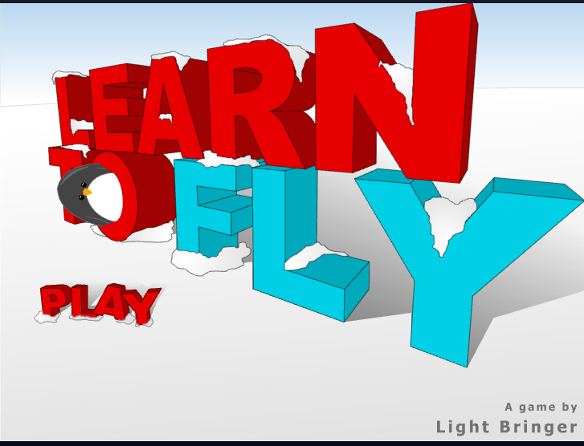
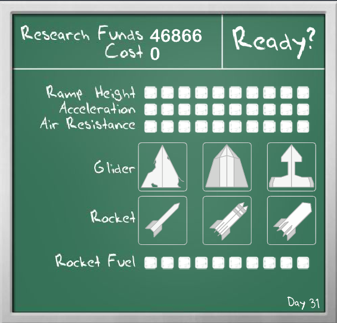
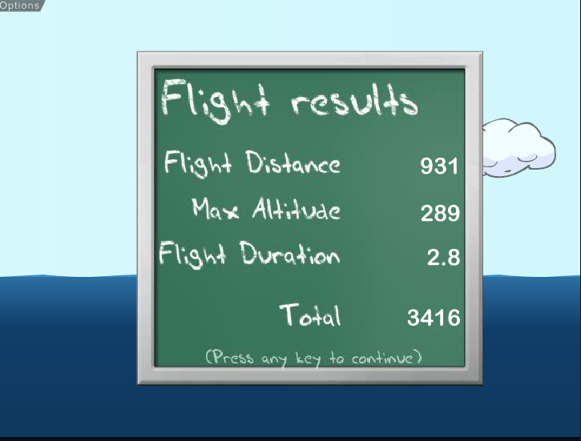

# Learn To Fly Bootleg

## Player

You play as a penguin that goes down a ramp and tries to fly N number of meteres to win the game.

You can buy upgrades that include:

1. Acceleration
2. Air Resistance
3. Rocket Fuel
4. Glider
5. Rocket

You control the character by pressing **left arrow** and **right arrow** to change the angle of the penguin.

## Flight

1. We need to simulate drag, lift and air resistance.
2. The angle of the penguin can change on the y axis.
   - Split a circle with a straight line in the middle(our y axis).
   - We are left with 2 halves each with 180 degrees.
   - Consider only the right most one, that is the range of motion
   - Basically he can go at most straight up or straight down, no toppling over or going backwards.

## Menus

1. Press play with some background

   

2. Shop menu

   

3. Flight results

   

## Game state

There can be at most one save file.

Save file contains the persistent state of the game like:

1. Money
2. Number of days
3. Most distance traveled
4. Shop state(includes upgrades and gear)

## Run

1. Player presses the ready button from the shop menu.
2. The run ends when the player reaches the ground.
3. The results menu pops up
4. After any key press the player goes back to the shop menu.

## Run state

1. When the player presses play a game state file is created.
2. When a run ends the game file is updated.

## Ice generation

I dont think it is going to be a problem if we render N number of sheets at once to be enough for the whole game.

But in case it is a problem, render 4 ice segments

Per every 1 segment traveled, render 2 more.
